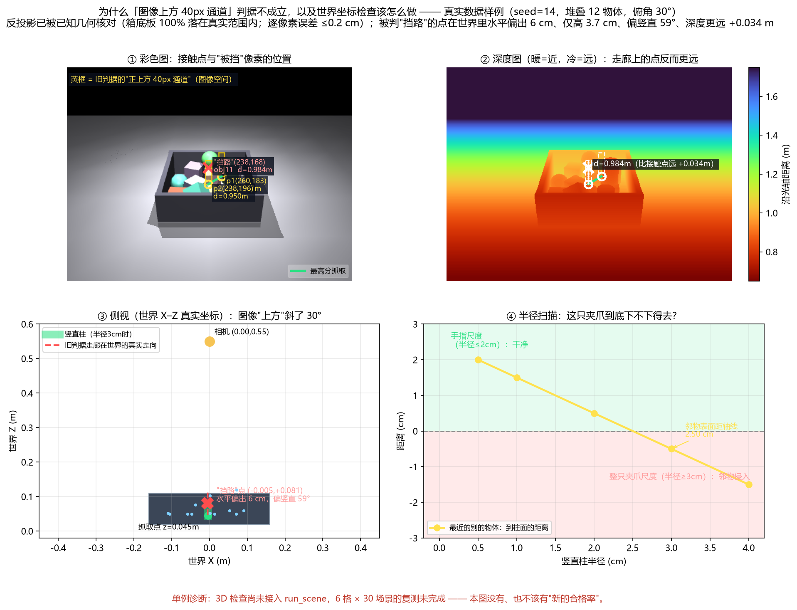

# 料箱抓取点选择 Demo（MuJoCo 仿真）— 附一次判据自查

用**单张深度图**在仿真料箱里选平行夹爪的抓取点，并量化一个我们后来自己推翻的判定标准。

> 一句话：这不是"我做了 bin picking 系统"，而是一个**最小验证** —— 把最朴素的抓取点选择方法跑通、
> 量化它、然后自己发现自己用的判定标准在物理上不成立，并把这件事查清、写下来。



---

## 1. 做什么

1. MuJoCo 里搭料箱（bin）+ 随机摆放的零件（方块 / 圆柱 / 球），渲染**彩色图 / 深度图 / 分割图**
2. **只看深度图**为每个物体找抓取点：遍历 18 个方向 × 5 条扫过线，以该方向上的**投影宽度**作为夹爪
   开合宽度；宽度落在 2.5–8.5 cm 内为可行，再按"宽度是否接近理想值 + 夹持面是否平坦"各 0.5 权重打分，
   非极大值抑制（NMS，40 px）后输出前 3 个候选
3. 用分割图（真值）**事后判分**：两个接触点是否属于同一物体、夹爪闭合路径是否被别的物体挡住、
   "从上方下手的通道"是否被挡住
4. 跑对照实验（相机俯角 × 场景密集度），并做**失败原因普查**

**产出**：一张四联图（抓取标注 / 原彩色图 / 深度图 / 抓取质量热图）+ 一组统计数字。

## 2. 怎么跑

依赖：Python 3.11、MuJoCo 3.13（`mujoco/numpy/matplotlib/pillow`，见 `requirements.txt`）。

```bash
pip install -r requirements.txt

python bin_picking_demo.py 30    # 30 个场景（默认稀疏 6 物体），输出 demo_result.png + demo_summary.txt
python compare_angles.py 30      # 对照实验：俯角 30/45/60° × 稀疏/堆叠，各 30 场景
python census.py 30              # 失败原因普查：五分类
```

结果**完全确定性**（固定随机种子 0–29，无 GPU/时间依赖），所以可以逐项核对：

| 命令 | 预期输出 |
|---|---|
| `census.py 30` | `0 / 0 / 4 / 23 / 3`（选不出候选 / 两点不同物体 / 闭合路径被挡 / 上方通道被挡 / 成功） |
| `compare_angles.py 30` | 稀疏 30% / 37% / 27%（30/45/60°）；堆叠 10% / 20% / 10% |

Windows 上给非技术用户做了两个双击入口：`run_studio.bat`（抓取仿真台，转旋钮立刻看结果）、
`run_compare.bat`（一键跑对照实验）。脚本的输出路径都是**相对脚本目录**的，clone 到哪都能跑。

## 3. 结果（以及必须一起写清的口径）

**判定标准**：两个接触点在同一物体上 **+** 夹爪闭合路径无遮挡 **+** 接触点正上方 40 px 通道无遮挡；
统计只看**排名第一**的候选（前 3 个仅用于展示）。

| 场景 | 相机俯角 | 选出抓取 | 抓取合格 | 合格率 |
|---|---|---|---|---|
| 稀疏（6 个物体） | 30° | 30/30 | 9/30 | 30% |
| 稀疏 | 45° | 30/30 | 11/30 | 37% |
| 稀疏 | 60° | 30/30 | 8/30 | 27% |
| 堆叠（12 个物体） | 30° | 30/30 | 3/30 | 10% |
| 堆叠 | 45° | 30/30 | 6/30 | 20% |
| 堆叠 | 60° | 30/30 | 3/30 | 10% |

对照实验用的是**同一批随机种子（0–29）、同一物体数、同一版算法**，属配对比较。
⚠️ **这些数字不叫"抓取成功率"**：它们是"在我自定义的判定标准下、只看 top-1、纯仿真 2D 图像空间"的合格率，
不经任何碰撞/运动学校验，也没有真机。

## 4. 自己推翻了自己的判定标准（本项目最有价值的部分）

失败原因普查显示，堆叠场景里失败**几乎全部**由"上方 40 px 通道被挡"造成（30°/45°/60° 分别为 23/20/25 场，
"选不出候选"恒为 0）。于是回头核对这条判据本身：

- 相机俯角 30° 时，**图像里的"向上"对应世界方向 R[:,1]，它与世界竖直 +Z 差 30°**
- 把"接触点上方 40 px 通道"逐像素反投影到世界坐标：被判"挡路"的那个点位于抓取点
  **水平 6.1 cm 之外、只高 3.7 cm**，与竖直方向差 **58.8°**，而且深度**更远**（0.984 m vs 0.950 m）
- 结论：这条走廊在世界里是"斜着往上、同时往外飞"的线，**它挡住的是斜后方远处的物体，不是下手的通道**

**能写进报告的结论**：
> 单张深度图**无法**判断夹爪能否从正上方进入抓取位置——"正上方有没有被别的物体占着"在图像上
> 不是一个可以往上找的问题，必须回到**世界坐标的 3D 几何**。

**修正方向与已完成的部分**：把接触点反投影到世界坐标，在抓取点处放一个真实几何体
（半径 3 cm、高 5 cm 的圆柱，代表夹爪下行所需空间），直接用 MuJoCo 的
`mj_geomDistance` 做**带符号的表面距离**检查（负值=侵入）。同一例中：

| 竖直柱半径 | 最近的**别的**物体到柱面距离 |
|---|---|
| 0.5 cm | +2.00 cm |
| 1.0 cm | +1.50 cm |
| 2.0 cm | +0.50 cm |
| 3.0 cm | **−0.50 cm（侵入）** |

→ 这只夹爪张 5.47 cm，而邻物表面距抓取点正上方那条线只有 **2.50 cm**：算不算"挡路"
**取决于手指厚度与接近方式**，即必须先定义夹爪模型 —— 这正说明"把像素判据换成 3D 判据"不是
换一行代码的事。

**⚠️ 复测尚未完成**：3D 检查还没有接进 `run_scene`，6 格 × 30 场景的对照表**没有重跑**，
所以本仓库**没有、也不该有"新的合格率"数字**。单例只能证明旧判据会误判、以及正确判据该长什么样。
完整诊断（内参推导、深度定义、像素↔世界变换自检、API 标定、逐像素走廊表）见
[`criterion_failure_evidence.md`](criterion_failure_evidence.md)。

## 5. 已知局限（诚实清单）

- **代码由 AI 辅助生成**：作者提出目标、驱动迭代、运行与核对结果；核心函数（`grasp_for_object`、
  `run_scene` 的判定段、`census.classify` 五分类）作者可逐行解释
- 判定是 **2D 图像空间**的近似，无碰撞检测、无运动学可达性、无夹爪模型
- **单张深度图**只看得到第一层表面，物体后面的空间没有信息；也没有第二个视角
- 仿真物体形状整齐（方块/圆柱/球），真实料箱有反光/透明/堆叠遮挡
- 场景的"随机"只在平面内（x, y 随机），高度是确定式堆叠；**无重复实验方差、无置信区间**
- 未做真机验证（下一步：RealSense + 机械臂闭环）

## 6. 目录结构

```
bin_picking_demo.py              主程序：场景生成 / 深度图 / 抓取点选择 / 判分 / 四联图
census.py                        失败原因五分类普查（判据出问题的起因）
compare_angles.py                对照实验：俯角 × 密集度
explain_why_criterion_fails.py   判据证伪诊断：内参 / 反投影自检 / 世界坐标间隙检查   ← 最新的
probe_sensitivity.py             单像素反投影误差 + 柱半径敏感性
clearance_check.py               排除目标自身后的逐物体间隙检查
explain_metric.py, explain_figures.py   两张解释性示意图
grasp_studio.py, run_studio.bat  抓取仿真台（Tkinter，可双击运行）
compare_result.md                对照结果表（**报告里引用这一份**）
failure_census.txt               失败归因表
criterion_failure_evidence.md/.png       判据证伪的完整证据
上手指南.md / demo_guide.pdf      名词解释、两周上手路线、更正记录、数字口径（附四）
```

**数字口径警告**：本目录历史上出现过四套数字（旧判据的 27/30=90%、只跑 5 场的 0/5、
当前的 27–37%/10–20%、失败归因）。**只引用 `compare_result.md` 与 `failure_census.txt`**，
其余是过程产物，别当结论。

## 7. 下一步

1. **定义夹爪模型**（手指厚度、接近方式）→ 把 3D 间隙判据接进 `run_scene` → 重跑 6 格 × 30 场景（复测）
2. 物体 6D 位姿估计（当前只做 2D 抓取矩形，不涉及物体朝向与翻转）
3. 接真机：RealSense D435 + 机械臂，把抓取点送到闭环
4. 加入第二个视角 / 主动视角选择，处理"看得见但下不去手"的问题
