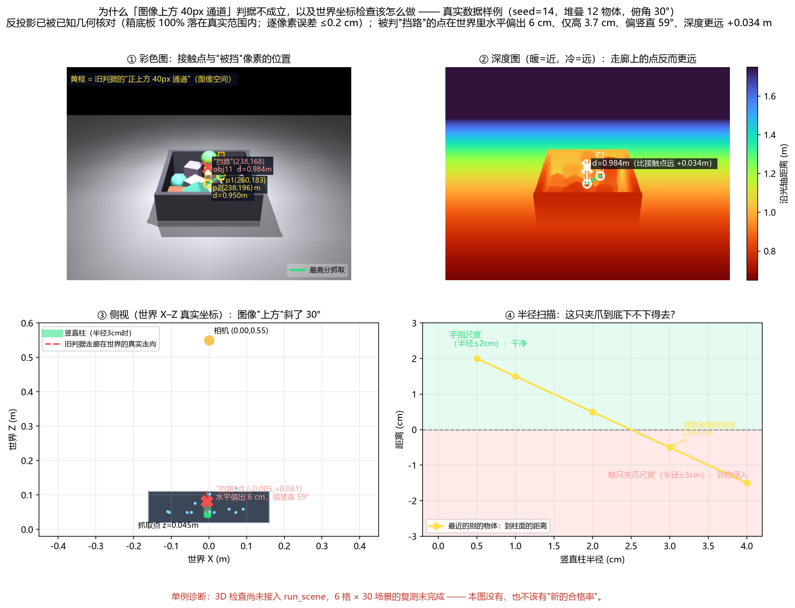
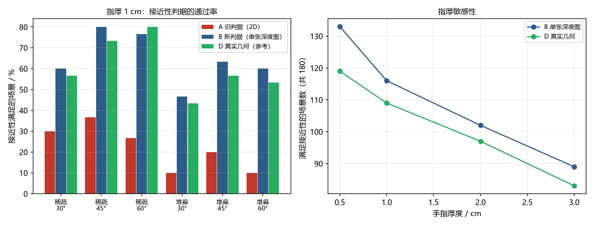
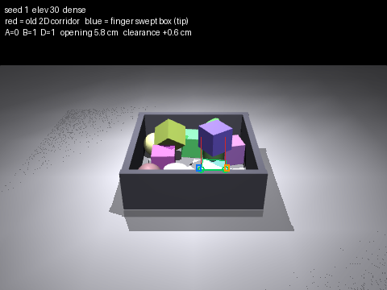

# Depth-image grasp-point selection in MuJoCo

**English** · [中文版 ↓](#中文版)

I pick grasp points for a parallel-jaw gripper inside a simulated bin, using one depth image. Then I
checked the rule I was scoring those picks against, found it does not hold up physically, built a
replacement, and re-ran the comparison. Most of this repository is that work: the audit, the new
criterion, and what changes when you put the two side by side.

Scope is one bin, one depth image, simulation only. This is not a bin-picking system.



## 1. What it does

1. Builds a bin in MuJoCo with randomly placed parts (box, cylinder, sphere) and renders RGB, depth
   and segmentation images.
2. Picks one grasp point per object from the depth image alone: 18 orientations by 5 scan lines, with
   the projected width in that direction as the gripper opening. A width between 2.5 and 8.5 cm counts
   as feasible. Candidates score 0.5/0.5 on how close the width is to ideal and how flat the contact
   surface is, then non-maximum suppression at 40 px leaves the top 3.
3. Scores the pick afterwards against the segmentation ground truth. Both contact points have to be on
   the same object, the closing path has to be clear, and the 40 px corridor directly above the contact
   point has to be clear. That third condition is the one that turned out to be wrong.
4. Runs a paired comparison over camera elevation and scene density, a failure census, and (as of this
   revision) a 3D re-test of the approach condition.

Output is a four-panel figure and the summary statistics.

## 2. What I found

The failure census put almost every stacked-scene failure into one class: the 40 px corridor above the
contact point was blocked (23, 20 and 25 of 30 scenes at 30, 45 and 60 degrees). "No candidate found"
was 0 in every cell. That sent me back to check the criterion itself.

At 30 degrees of camera elevation, "up" in the image is world direction `R[:,1]`, which sits 30 degrees
off world +Z. Back-projecting that 40 px corridor pixel by pixel puts the point flagged as blocking at
6.1 cm laterally from the grasp point and only 3.7 cm higher: 58.8 degrees off vertical, and farther
away in depth (0.984 m against 0.950 m). In world coordinates the corridor slants up and outwards. What
it flags is a distant object behind and above the grasp point, not the path the gripper would take.

A single depth image cannot answer whether the gripper can come down onto a grasp position. Searching
upwards in the image is not the same question as whether the volume the fingers need is free, and the
two answers disagree often enough to matter (section 4).

## 3. The replacement, and the re-test

The fix needs a gripper. I defined one in `gripper_model.py`: two fingers, each a box with a thickness
(1 cm by default, swept 0.5/1/2/3 cm), a width (2 cm) and a length above the grasp plane (4 cm), and a
6 cm standoff where the descent starts. Each finger becomes two boxes:

- a **tip box**, the first 5 mm above the grasp plane. Touching the target here is normal.
- a **body box**, from 5 mm up to the standoff. Anything in this box blocks the descent, including the
  target if it bulges out above the grasp line.

A candidate passes if no other object touches either tip box and nothing at all touches either body
box. Two versions get evaluated on every scene:

- **B, single depth image.** Back-project the depth image into a world point cloud and test the boxes
  against those points. This is what a real system could actually compute.
- **D, true geometry.** Put the same boxes into the simulator and use `mj_geomDistance` for exact
  signed distances to the real parts. A real system cannot do this; it is here to show how much the
  single view misses.

`criterion3d.py` runs both over the same 6 cells by 30 scenes, seeds 0–29, unchanged scene generation
and rendering. The old 2D criterion is re-implemented alongside them (A) and reproduces the numbers in
`compare_result.md` exactly, which is the check that the re-test is being run on the same footing.



## 4. Results

Old criterion (A, 2D image space), paired comparison over the same seeds 0–29. Only top-1 candidates
are counted; the top 3 are for display.

| Scene | Camera elevation | Grasp selected | Grasp valid | Valid rate |
|---|---|---|---|---|
| Sparse (6 objects) | 30° | 30/30 | 9/30 | 30% |
| Sparse | 45° | 30/30 | 11/30 | 37% |
| Sparse | 60° | 30/30 | 8/30 | 27% |
| Stacked (12 objects) | 30° | 30/30 | 3/30 | 10% |
| Stacked | 45° | 30/30 | 6/30 | 20% |
| Stacked | 60° | 30/30 | 3/30 | 10% |

Same scenes, same candidates, approach condition now evaluated in world coordinates with a 1 cm finger.
The three conditions share the first two checks (both contacts on the target, closing path clear), so
the differences come only from the approach test.

| Scene | Elevation | Candidate | Checks passed | A old 2D | B single depth image | D true geometry |
|---|---|---|---|---|---|---|
| Sparse | 30° | 30/30 | 29/30 | 9/30 | 18/30 | 17/30 |
| Sparse | 45° | 30/30 | 29/30 | 11/30 | 24/30 | 22/30 |
| Sparse | 60° | 30/30 | 29/30 | 8/30 | 23/30 | 24/30 |
| Stacked | 30° | 30/30 | 26/30 | 3/30 | 14/30 | 13/30 |
| Stacked | 45° | 30/30 | 26/30 | 6/30 | 19/30 | 17/30 |
| Stacked | 60° | 30/30 | 28/30 | 3/30 | 18/30 | 16/30 |

Across all 180 scenes, 167 pass the first two checks. Within those:

| | D says graspable | D says blocked |
|---|---|---|
| A old 2D says graspable | 28 | 12 |
| A old 2D says blocked | 81 | 46 |

| | D says graspable | D says blocked |
|---|---|---|
| B single depth image says graspable | 105 | 11 |
| B single depth image says blocked | 4 | 47 |

Read the first table as the cost of asking the wrong question. The old criterion passed 40 candidates
and 12 of those are actually blocked, while it rejected 127 candidates of which 81 are free by true
geometry. The second table is the replacement: 116 passes against the reference's 109, with the
disagreement falling into 11 over-accepted and 4 over-rejected.

The 11 over-accepted are the price of one viewpoint. With a 1 cm finger, the volume the fingers will
sweep looks empty in the depth image because the obstacle is behind a visible surface. Thicker fingers
make this worse, since there is more volume to check and more of it hidden:

| Finger thickness | A old 2D | B single depth image | D true geometry |
|---|---|---|---|
| 0.5 cm | 40/180 | 133/180 | 119/180 |
| 1.0 cm | 40/180 | 116/180 | 109/180 |
| 2.0 cm | 40/180 | 102/180 | 97/180 |
| 3.0 cm | 40/180 | 89/180 | 83/180 |

Read that as a gripper choice rather than only a sensitivity check: of the 167 admissible scenes, 48
are blocked at every thickness, 83 are free at every thickness, and 36 are free with a 5 mm finger and
blocked with a 3 cm one.

One candidate quality number falls out of the re-test: the closing direction ends up a median of 0.0°
off horizontal, which is the pose a top-down two-finger gripper wants, with a worst case of 60.3° on
tilted surfaces.

`criterion3d_case.png` draws the two criteria on one scene where they disagree (seed 1, 30°, stacked,
opening 5.78 cm): the red lines are the old corridor in image space, the blue boxes are what the
fingers actually need, and the true clearance for the descent is +0.6 cm.



None of these are grasp success rates. They count candidates whose geometry allows a descend with a
fixed gripper model, in simulation, with segmentation giving the target, and with no dynamics, no
friction, no kinematics and no real robot.

## 5. Reproduce

Python 3.11, MuJoCo 3.13 (`mujoco/numpy/matplotlib/pillow`, see `requirements.txt`).

```bash
pip install -r requirements.txt

python bin_picking_demo.py 30    # 30 scenes (default: sparse, 6 objects) -> demo_result.png + demo_summary.txt
python compare_angles.py 30      # paired comparison: elevation 30/45/60° × sparse/stacked, 30 scenes each
python census.py 30              # failure census: 5 classes
python criterion3d.py 30         # 3D re-test: criteria A/B/D, finger-thickness sweep -> criterion3d_result.md
python criterion3d_case.py       # one disagreeing scene, drawn -> criterion3d_case.png
python check_projection.py       # projection / distance-API self-check
```

Results are deterministic (fixed seeds 0-29, no GPU, no time dependence), so they can be checked item
by item. `python criterion3d.py --resummarize` rebuilds the tables and the figure from
`criterion3d_scenes.csv` without re-running the simulation.

| Command | Expected output |
|---|---|
| `census.py 30` | `0 / 0 / 4 / 23 / 3` (no candidate / two objects / closing path blocked / top corridor blocked / success) |
| `compare_angles.py 30` | sparse 30% / 37% / 27% (30/45/60°); stacked 10% / 20% / 10% |
| `criterion3d.py 30` | A 40/180, B 116/180, D 109/180; 81 old-criterion rejections are free by true geometry |
| `check_projection.py` | pixel round trip 0.0000 px; distance API 0.0800 m for a known 8 cm gap |

On Windows there are two double-click entries for non-technical users: `run_studio.bat` (grasp studio,
turn the dials and see the result immediately) and `run_compare.bat` (one-click paired comparison).
Script outputs are written relative to the script directory, so the repo runs after any clone.

## 6. Limitations

- The code was developed with AI assistance. I set the goals, drove the iterations, ran the experiments
  and checked the results. The core functions (`grasp_for_object`, the verdict block in `run_scene`,
  `census.classify`, `finger_boxes`) I can explain line by line.
- The gripper is two boxes. There is no palm, no kinematics, no reachability, no force or friction
  model, and the object never actually gets grasped.
- Both new criteria test whether a volume is free, not whether a grasp holds. A candidate can pass and
  still slip.
- The single-view cloud (B) sees the first surface only. The 11 over-accepted scenes are exactly that
  blind spot, and the gap widens with finger thickness.
- D uses the simulator's own geometry, so it is a reference for the geometry question and not something
  a deployed system can compute.
- Simulated parts are regular (box, cylinder, sphere). Real bins contain reflective, transparent and
  heavily occluded parts.
- Scene randomness is in-plane only (x and y random, height a deterministic stack), so there is no
  run-to-run variance and no confidence intervals. Everything is deterministic by construction.
- No physical-robot validation yet.

## 7. Layout

```
bin_picking_demo.py              main program: scene / depth image / grasp-point selection / scoring / 4-panel figure
census.py                        failure census, 5 classes (what started the criterion investigation)
compare_angles.py                paired comparison: elevation × density
explain_why_criterion_fails.py   criterion refutation: intrinsics / back-projection self-check / world-space clearance
criterion3d.py                   3D re-test: gripper model, criteria A/B/D, thickness sweep, result table   <- newest
gripper_model.py                 gripper parameters and the finger boxes the criteria test
criterion3d_case.py              draws one scene where the old and new criteria disagree
check_projection.py              projection and distance-API self-check
probe_sensitivity.py             single-pixel back-projection error + cylinder-radius sensitivity
clearance_check.py               per-object clearance check with the target itself excluded
explain_metric.py, explain_figures.py   two explanatory figures
grasp_studio.py, run_studio.bat  grasp studio (Tkinter, double-clickable)
compare_result.md                old criterion's comparison table (cite this one for the old numbers)
failure_census.txt               failure attribution table
criterion3d_result.md            new criterion's tables (cite this one for the new numbers)
criterion3d_scenes.csv           per-scene record of the re-test
criterion_failure_evidence.md/.png       full evidence for the criterion refutation
criterion3d_figure.png, criterion3d_case.png   re-test summary and one worked case
上手指南.md / demo_guide.pdf     glossary, two-week onboarding route, corrections log, number conventions (Chinese)
```

Three sets of numbers have lived in this directory at different times: the old criterion's 27 to 37%
and 10 to 20%, the broken criterion's 27/30 = 90%, and a five-scene run's 0/5. The last two are
intermediate artefacts and should not be cited. Cite `compare_result.md` and `failure_census.txt` for
the old criterion, and `criterion3d_result.md` for the 3D re-test. All of them are generated by the
scripts here, so every number can be reproduced.

## 8. Next steps

1. Second viewpoint, aimed at the cases where a visible surface hides an obstacle near the grasp. That
   is the 11-scene gap in section 4, and it is the cheapest thing to fix next.
2. 6D object pose estimation. Right now a candidate is a 2D grasp rectangle with no object orientation
   and no flipping.
3. Close the loop on a real robot: RealSense D435 and an arm.
4. Gripper selection rather than assumption. The thickness sweep exists so this can be an informed
   choice instead of a fixed 1 cm.

---

# 中文版

## 料箱抓取点选择 Demo（MuJoCo 仿真），附一次判据自查与重做

我在仿真料箱里用一张深度图为平行夹爪选抓取点。选完之后我去核对了一直在用的那条判分规则，
发现它物理上站不住，于是重做了一条，并把两种判据放在同一批场景上跑了一遍。这个仓库大部分内容
就是这件事：诊断、新判据、以及对照出来的差别。

范围只有一件事：一个料箱、一张深度图、只在仿真里。不是一套 bin picking 系统。


## 1. 做什么

1. MuJoCo 里搭料箱，随机摆放零件（方块 / 圆柱 / 球），渲染彩色图、深度图、分割图
2. 只看深度图为每个物体找抓取点：遍历 18 个方向 × 5 条扫过线，以该方向上的投影宽度作为夹爪开合
   宽度，落在 2.5–8.5 cm 内算可行；再按"宽度是否接近理想值"和"夹持面是否平坦"各占 0.5 打分，
   非极大值抑制（NMS，40 px）后留下前 3 个候选
3. 用分割图（真值）事后判分：两个接触点是否属于同一物体、夹爪闭合路径是否被挡、接触点正上方
   40 px 通道是否被挡。**出错的就是最后这一条**
4. 跑对照实验（相机俯角 × 场景密集度）、失败原因普查，以及这一版新加的 3D 接近性复测

产出是一张四联图和一组统计数字。

## 2. 我发现了什么

失败原因普查显示，堆叠场景的失败几乎全落在同一个类别里：接触点正上方 40 px 通道被挡
（30°/45°/60° 分别是 30 场里的 23/20/25 场），而"选不出候选"每一格都是 0。这让我回头去核对
这条判据本身。

相机俯角 30° 时，图像里的"向上"是世界方向 `R[:,1]`，它跟世界竖直 +Z 差 30°。把那条 40 px 通道
逐像素反投影到世界坐标，被判"挡路"的点位于抓取点水平 6.1 cm 之外、只高 3.7 cm：与竖直方向差
58.8°，而且深度更远（0.984 m 对 0.950 m）。这条通道在世界里是斜着往上、同时往外飞的线，它挡住的是
斜后方远处的物体，不是夹爪真正下手的路径。

单张深度图回答不了"夹爪能不能从正上方进入抓取位置"。在图像里往上找，和"手指要占的那块空间
是不是空的"，不是同一个问题，而两个答案的差别大到不能忽略（见第 4 节）。

## 3. 重做的判据，以及复测

这条判据需要先有夹爪。`gripper_model.py` 里定义了一个：两指，每指有厚度（默认 1 cm，另扫
0.5/1/2/3 cm）、宽度（2 cm）、抓取面上方的长度（4 cm），以及开始下压的高度（6 cm）。每个手指
拆成两个盒子：

- **指尖段**：抓取面往上 5 mm 内。这一段贴住目标是正常的。
- **指体段**：从 5 mm 到开始下压的高度。这一段里出现任何东西都算挡路，包括目标自己鼓出来的部分。

一个候选通过的条件是：其它物体不碰任何一个指尖段，并且任何东西（含目标自身）都不碰指体段。
每个场景都跑两个版本：

- **B，单张深度图**：把深度图反投影成世界坐标点云，用点云测那两个盒子。这是真实系统算得出的版本。
- **D，真实几何**：把同样的盒子作为几何体放进仿真，用 `mj_geomDistance` 算到真实零件的带符号距离。
  真实系统拿不到这一列，它是用来量"单视角漏了多少"的。

`criterion3d.py` 用同一套场景生成与渲染，在 6 格 × 30 场景、种子 0–29 上把两种都跑了一遍。
旧判据（A）也在同一次运行里重实现，它复现出的数字与 `compare_result.md` 完全一致——这是复测
确实站在同一基准上的证据。


## 4. 结果

旧判据（A，2D 图像空间），同一批种子 0–29 的配对比较。统计只看排名第一的候选，前 3 个仅用于展示。

| 场景 | 相机俯角 | 选出抓取 | 抓取合格 | 合格率 |
|---|---|---|---|---|
| 稀疏（6 个物体） | 30° | 30/30 | 9/30 | 30% |
| 稀疏 | 45° | 30/30 | 11/30 | 37% |
| 稀疏 | 60° | 30/30 | 8/30 | 27% |
| 堆叠（12 个物体） | 30° | 30/30 | 3/30 | 10% |
| 堆叠 | 45° | 30/30 | 6/30 | 20% |
| 堆叠 | 60° | 30/30 | 3/30 | 10% |

同一批场景、同一批候选，接近性改在世界坐标里判，指厚 1 cm。三种判据共用前两条检查（两点同物体、
闭合路径无遮挡），所以差别只来自接近性这一条。

| 场景 | 俯角 | 选出候选 | 前置通过 | A 旧2D | B 单张深度图 | D 真实几何 |
|---|---|---|---|---|---|---|
| 稀疏 | 30° | 30/30 | 29/30 | 9/30 | 18/30 | 17/30 |
| 稀疏 | 45° | 30/30 | 29/30 | 11/30 | 24/30 | 22/30 |
| 稀疏 | 60° | 30/30 | 29/30 | 8/30 | 23/30 | 24/30 |
| 堆叠 | 30° | 30/30 | 26/30 | 3/30 | 14/30 | 13/30 |
| 堆叠 | 45° | 30/30 | 26/30 | 6/30 | 19/30 | 17/30 |
| 堆叠 | 60° | 30/30 | 28/30 | 3/30 | 18/30 | 16/30 |

180 个场景里有 167 个通过前两条检查。在这 167 个里：

| | D 判能抓 | D 判挡 |
|---|---|---|
| A 旧2D 判能抓 | 28 | 12 |
| A 旧2D 判挡 | 81 | 46 |

| | D 判能抓 | D 判挡 |
|---|---|---|
| B 单张深度图 判能抓 | 105 | 11 |
| B 单张深度图 判挡 | 4 | 47 |

第一张表就是"问错问题"的代价：旧判据放行 40 个候选，其中 12 个真实几何判挡；它拦下 127 个，
其中 81 个真实几何判能抓。第二张表是新判据：放行 116 个，参考真值 109 个，分歧是 11 个多放行
和 4 个多拦下。

那 11 个多放行就是单视角的代价。指厚 1 cm 时，手指要扫过的那块空间在深度图里看起来是空的，因为
挡住它的东西藏在可见表面后面。手指越厚越糟，要检查的体积更大、藏起来的部分也更多：

| 指厚 | A 旧2D | B 单张深度图 | D 真实几何 |
|---|---|---|---|
| 0.5 cm | 40/180 | 133/180 | 119/180 |
| 1.0 cm | 40/180 | 116/180 | 109/180 |
| 2.0 cm | 40/180 | 102/180 | 97/180 |
| 3.0 cm | 40/180 | 89/180 | 83/180 |

这张表可以当成挑夹爪的依据：167 个通过前置的场景里，48 个在任何指厚下都过不去，83 个四种指厚下
都下得去，剩下 36 个只有 0.5 cm 的薄手指下得去、换成 3 cm 就不行。

复测还顺带出来一个候选质量数字：闭合方向偏离水平的中位数是 0.0°，这正是自上而下的两指夹爪想要的
姿态，最差的一个是 60.3°（出现在斜面物体上）。

`criterion3d_case.png` 把两种判据画在同一个分歧场景上（种子 1，30°，堆叠，张开 5.78 cm）：红线是
旧判据在图像空间里的通道，蓝框是手指真正需要的空间，真实几何给出下压余隙 +0.6 cm。


这些都不是抓取成功率。它们统计的是"在固定夹爪模型下、几何上允许下压"的候选数，只在仿真里，
分割图直接给出目标，没有动力学、没有摩擦、没有运动学，也没有真机。

## 5. 怎么跑

依赖：Python 3.11、MuJoCo 3.13（`mujoco/numpy/matplotlib/pillow`，见 `requirements.txt`）。

```bash
pip install -r requirements.txt

python bin_picking_demo.py 30    # 30 个场景（默认稀疏 6 物体），输出 demo_result.png + demo_summary.txt
python compare_angles.py 30      # 对照实验：俯角 30/45/60° × 稀疏/堆叠，各 30 场景
python census.py 30              # 失败原因普查：五分类
python criterion3d.py 30         # 3D 复测：判据 A/B/D + 指厚扫描 -> criterion3d_result.md
python criterion3d_case.py       # 画出一个分歧场景 -> criterion3d_case.png
python check_projection.py       # 投影与距离 API 自检
```

结果完全确定性（固定随机种子 0–29，无 GPU、无时间依赖），可以逐项核对。
`python criterion3d.py --resummarize` 可以直接从 `criterion3d_scenes.csv` 重算表和重画图，
不用重跑仿真。

| 命令 | 预期输出 |
|---|---|
| `census.py 30` | `0 / 0 / 4 / 23 / 3`（选不出候选 / 两点不同物体 / 闭合路径被挡 / 上方通道被挡 / 成功） |
| `compare_angles.py 30` | 稀疏 30% / 37% / 27%（30/45/60°）；堆叠 10% / 20% / 10% |
| `criterion3d.py 30` | A 40/180，B 116/180，D 109/180；旧判据拦下的里头有 81 个真实几何判能抓 |
| `check_projection.py` | 像素往返 0.0000 px；距离 API 在已知 8 cm 间距上给出 0.0800 m |

Windows 上给非技术用户做了两个双击入口：`run_studio.bat`（抓取仿真台，转旋钮立刻看结果）、
`run_compare.bat`（一键跑对照实验）。脚本输出路径都相对脚本目录，clone 到哪都能跑。

## 6. 局限

- 代码由 AI 辅助编写。目标、迭代方向、实验运行和结果核对都是我做的；核心函数
  （`grasp_for_object`、`run_scene` 的判定段、`census.classify`、`finger_boxes`）我能逐行解释
- 夹爪就是两个盒子。没有手掌、没有运动学、没有可达性、没有力和摩擦模型，也没有真的抓起来
- 两条新判据判的是"这块体积空不空"，不是"抓得住抓不住"。通过的候选照样可能滑掉
- 单视角点云（B）只看得到第一层表面。那 11 个多放行的场景就是这块盲区，指厚越大差距越大
- D 用的是仿真自己的几何，所以它是几何问题的参考真值，不是真实系统算得出来的东西
- 仿真物体形状整齐（方块 / 圆柱 / 球），真实料箱里有反光、透明、严重遮挡的零件
- 场景的随机只在平面内（x、y 随机，高度是确定式堆叠），所以没有重复实验方差，也没有置信区间，
  全部按构造确定性
- 还没做真机验证

## 7. 目录结构

```
bin_picking_demo.py              主程序：场景生成 / 深度图 / 抓取点选择 / 判分 / 四联图
census.py                        失败原因五分类普查（判据出问题的起因）
compare_angles.py                对照实验：俯角 × 密集度
explain_why_criterion_fails.py   判据证伪诊断：内参 / 反投影自检 / 世界坐标间隙检查
criterion3d.py                   3D 复测：夹爪模型、判据 A/B/D、指厚扫描、结果表   ← 最新
gripper_model.py                 夹爪参数与判据要测的那两组盒子
criterion3d_case.py              画出一个新旧判据分歧的场景
check_projection.py              投影与距离 API 自检
probe_sensitivity.py             单像素反投影误差 + 柱半径敏感性
clearance_check.py               排除目标自身后的逐物体间隙检查
explain_metric.py, explain_figures.py   两张解释性示意图
grasp_studio.py, run_studio.bat  抓取仿真台（Tkinter，可双击运行）
compare_result.md                旧判据的对照结果表（旧数字引用这一份）
failure_census.txt               失败归因表
criterion3d_result.md            新判据的结果表（新数字引用这一份）
criterion3d_scenes.csv           复测的逐场景记录
criterion_failure_evidence.md/.png       判据证伪的完整证据
criterion3d_figure.png, criterion3d_case.png   复测汇总图与一个样例
上手指南.md / demo_guide.pdf      名词解释、两周上手路线、更正记录、数字口径
```

本目录历史上出现过三套数字：旧判据的 27–37% 与 10–20%、坏判据的 27/30=90%、只跑 5 场的 0/5。
后两套是过程产物，别引用。旧判据引用 `compare_result.md` 和 `failure_census.txt`，3D 复测引用
`criterion3d_result.md`。这几份都是本仓库脚本生成的，任何数字都能重跑出来。

## 8. 下一步

1. 加第二个视角，专门看"可见表面挡住了抓取点附近的障碍"这类情况。这就是第 4 节里 11 个场景的差距，
   也是眼下最便宜的一步
2. 物体 6D 位姿估计。现在一个候选只是一个 2D 抓取矩形，不涉及物体朝向和翻转
3. 接真机：RealSense D435 + 机械臂，把抓取点送进闭环
4. 不再假设夹爪，而是挑夹爪。指厚扫描就是为了让这个选择有依据，而不是固定 1 cm
